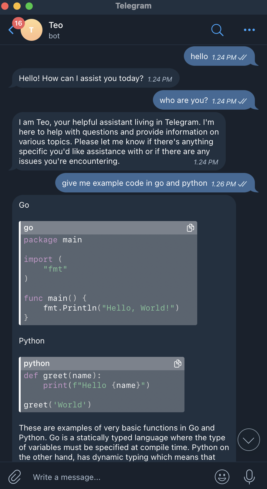
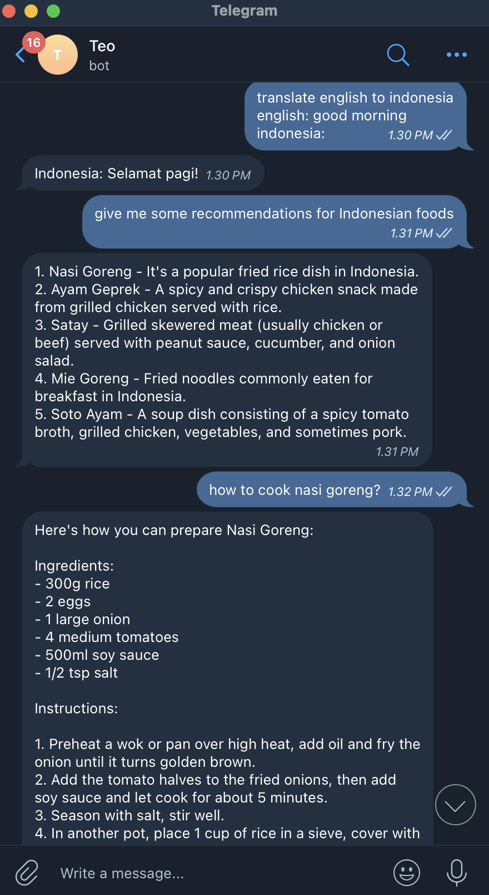
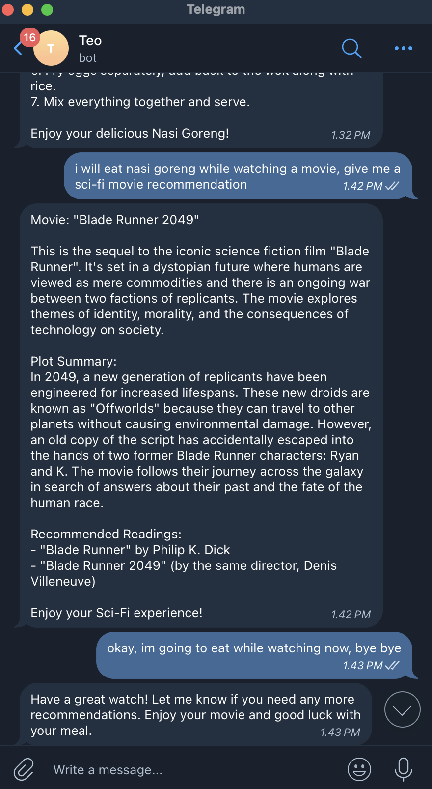
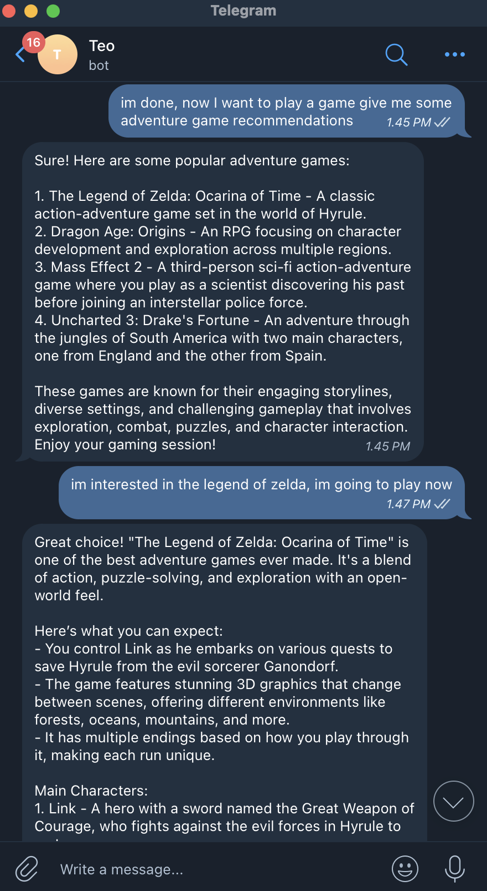

# TEO

|  |  |  |  |
|:---:|:---:|:---:|:---:|

Telegram Ollama Integration

# Table of Contents
- [TEO](#teo)
- [Table of Contents](#table-of-contents)
  - [Development](#development)
    - [Prerequisites](#prerequisites)
      - [Ollama](#ollama)
      - [Redis](#redis)
      - [MongoDB](#mongodb)
      - [RabbitMQ](#rabbitmq)
    - [Running the Backend](#running-the-backend)
    - [Running the Consumer](#running-the-consumer)
    - [Generate Swagger Documentation](#generate-swagger-documentation)
  - [Deployment](#deployment)
  - [Telegram Bot Setup](#telegram-bot-setup)
    - [Setting the Webhook](#setting-the-webhook)
      - [Public IP or Domain](#public-ip-or-domain)
      - [Localhost Setup](#localhost-setup)
      - [Bot Token](#bot-token)
      - [Setting the Webhook](#setting-the-webhook-1)
    - [Optional](#optional)
      - [Get Webhook Info](#get-webhook-info)
      - [Delete Webhook](#delete-webhook)


## Development

### Prerequisites

Before development process, ensure you have the following installed:

#### Ollama

Ensure you have Ollama installed by following the instructions in the official repository [Ollama GitHub](https://github.com/ollama/ollama?tab=readme-ov-file#ollama).

Additionally, you need to have at least one model installed.

The default model specified in the `.env `file is `qwen2.5:1.5b-instruct`.

To install it, run the following command in your terminal:

```
ollama pull qwen2.5:1.5b-instruct
```
Ensure the model is downloaded:

```
ollama ls
```

#### Redis

It is recommended to use Docker to install Redis. If you haven’t installed Docker yet, you can follow the official Docker installation guide.

To install Redis using Docker, run the following command:

```
docker pull redis
```
Then, start Redis with:

```
docker run --name redis-server -d -p 6379:6379 redis
```
Ensure Redis is running by checking with:

```
docker ps
```

#### MongoDB

Similarly, use Docker to install MongoDB. Run the following command to pull the MongoDB image:
```
docker pull mongo
```
Start MongoDB with:

```
docker run --name mongodb-server -p 27017:27017 -v mongodb-data:/data/db -d mongo
```

Ensure MongoDB is running by checking with:
```
docker ps
```

#### RabbitMQ

Run the following command to pull the RabbitMQ image:

```bash
docker pull rabbitmq:4.0.2-management
```

Once the image is downloaded, start RabbitMQ with the following command:

```
docker run -d --name rabbitmq -p 5672:5672 -p 15672:15672 rabbitmq:4.0.2-management
```

- **Port 5672**: Used for RabbitMQ communication (AMQP).
- **Port 15672**: Used for accessing the RabbitMQ Management UI.

Ensure RabbitMQ is running by checking with:

```
docker ps
```

You can access the RabbitMQ Management UI in your browser at:

```
http://localhost:15672
```

**Username:** `guest`  
**Password:** `guest`

### Running the Backend
1. **Clone the Repository**
   ```sh
   git clone https://github.com/Shiyinq/teo.git
   cd teo
   ```

2. **Install Go Modules**
   ```sh
   go mod tidy
   ```

3. **Create .env File**
   ```sh
   cp .env.example .env
   ```

4. **Install Air for Live Reloading**

   If you don't have `air` installed on your machine, install it first:
   ```sh
   go install github.com/air-verse/air@latest
   ```

5. **Run the Development Server**
   ```sh
   air
   ```

6. **Server**

    http://localhost:8080

### Running the Consumer
   The consumer must run alongside the backend to work correctly. 
   
   Use the following command in another terminal:
   ```sh
      go run cmd/consumer/consumer.go
   ```

   After starting the backend and consumer, follow this instructions [Telegram Bot Setup](#localhost-setup).

### Generate Swagger Documentation
1. **Install Swagger for API Documentation**

   If you don't have `swag` installed on your machine, install it first:
   ```sh
   go install github.com/swaggo/swag/cmd/swag@latest
   ```

2. **Generate or Update Documentation**
    ```sh
    swag init -g ./cmd/server/main.go --parseDependency --parseInternal --output docs/swagger
    ```
    Or you can use the `swag.sh` script:

    For the first time, before running the script, execute:
    ```
    chmod +x swag.sh
    ```
    Then, run:
    ```
    ./swag.sh
    ```

3. **Swagger Documentation**

    http://localhost:8080/docs/index.html

## Deployment

Before you begin, ensure you have [Docker](https://docs.docker.com/engine/install/) installed.

**1. Clone the Repository**
```sh
git clone https://github.com/Shiyinq/noto.git
cd noto
```

**2. Create Environment Files**
```sh
cp .env.example .env
```

Open each `.env` file you have created and update the values as needed.

**3. Build and Run the Docker Containers**
```sh
docker compose up --build -d
```

Wait a few minutes for the setup to complete, it should look like this:

```sh
✔ Network teo_default       Created                                                                                                      0.0s 
✔ Container teo-rabbitmq-1  Healthy                                                                                                      6.4s 
✔ Container teo-mongodb-1   Healthy                                                                                                      6.4s 
✔ Container teo-redis-1     Healthy                                                                                                      5.9s 
✔ Container teo-consumer-1  Started                                                                                                      6.5s 
✔ Container teo-backend-1   Started                                                                                                      6.5s 
```

You can access the backend at http://localhost:8080 and the documentation at http://localhost:8080/docs.

## Telegram Bot Setup

### Setting the Webhook
After running the backend, either using Docker or manually, you need to set up the webhook with the Telegram API.

#### Public IP or Domain

If your server has a public IP or domain, you can directly set the webhook to Telegram:

```
https://yourdomain.com
```

#### Localhost Setup
If you are running the backend locally, you need to use a tool like [ngrok](https://ngrok.com) to expose your local server to the internet. You can run the following command:

```
ngrok http 8080
```

This will generate a public URL, and your webhook will look something like this:

```
https://9e64-114-124-182-000.ngrok-free.app
```
#### Bot Token
You can obtain a bot token from [BotFather](https://t.me/BotFather).

#### Setting the Webhook
To set the webhook with Telegram, use the following API endpoint:

```
https://api.telegram.org/bot{my_bot_token}/setWebhook?url={your_domain_or_your_ip_public_or_ngrok_url}/webhook/telegram
```

Example:

```
https://api.telegram.org/bot123456:ABC-DEF1234ghIkl-zyx57W2v1u123ew11/setWebhook?url=https://9e64-114-124-182-000.ngrok-free.app/webhook/telegram
```

### Optional
#### Get Webhook Info
You can retrieve the current webhook info using:

```
https://api.telegram.org/bot{my_bot_token}/getWebhookInfo
```

#### Delete Webhook
To remove the webhook, make a call to the `setWebhook` method with an empty `url` parameter:

```
https://api.telegram.org/bot{my_bot_token}/setWebhook?url=
```